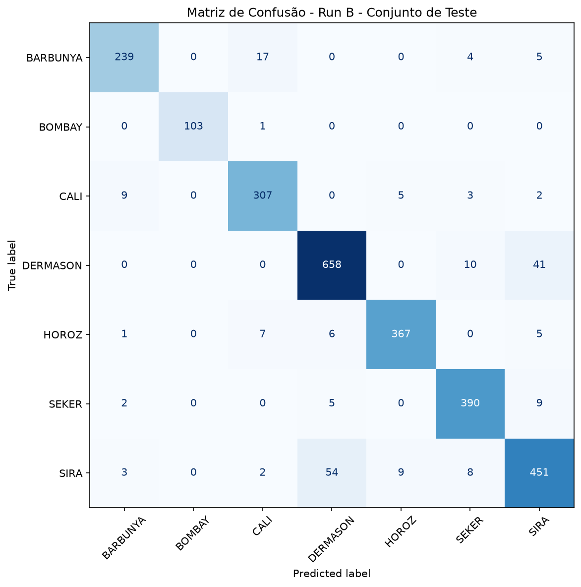

# Classificação de Grãos de Feijão com PyTorch e MLflow

Projeto desenvolvido para construção de um pipeline de Machine Learning observável e reproduzível, utilizando **PyTorch** para treinamento de uma rede neural MLP e **MLflow** para rastreamento dos experimentos.

O objetivo é classificar diferentes variedades de feijão a partir de características morfológicas do grão e comparar diferentes configurações de treinamento de forma controlada.

---

## Dataset

Foi utilizado o **Dry Bean Dataset**, disponibilizado pelo UCI Machine Learning Repository.

O conjunto contém **13.611 amostras**, representando sete variedades de feijão:

- BARBUNYA
- BOMBAY
- CALI
- DERMASON
- HOROZ
- SEKER
- SIRA

Cada amostra possui **16 atributos numéricos** relacionados às dimensões e características de formato dos grãos.

O problema é de **classificação multiclasse**, com sete classes possíveis.

---

## Objetivo experimental

O experimento busca analisar o impacto da **taxa de aprendizado (learning rate)** e da **regularização L2** no desempenho e estabilidade de uma rede neural MLP.

Foram mantidos constantes:

- arquitetura da rede;
- divisão dos dados;
- número de épocas;
- tamanho do batch;
- seed;
- otimizador;
- função de perda.

Dessa forma, as diferenças observadas entre as execuções podem ser relacionadas principalmente aos hiperparâmetros analisados.

---

## Preparação dos dados

O dataset foi dividido em:

| Conjunto | Proporção |
|---|---:|
| Treinamento | 64% |
| Validação | 16% |
| Teste | 20% |

A divisão foi realizada utilizando **estratificação das classes** e seed fixa (`42`).

Para evitar **data leakage**, o `StandardScaler` é ajustado exclusivamente sobre o conjunto de treinamento.

Posteriormente, o mesmo scaler é utilizado para transformar os conjuntos de validação e teste.

O conjunto de teste permanece reservado durante os experimentos e é utilizado somente após a escolha da configuração final.

---

## Arquitetura do modelo

Foi utilizada uma rede neural do tipo **Multilayer Perceptron (MLP)** implementada em PyTorch.

Arquitetura:

```text
Entrada: 16 atributos
        ↓
Linear (16 → 64)
        ↓
ReLU
        ↓
Linear (64 → 32)
        ↓
ReLU
        ↓
Linear (32 → 7)
        ↓
Saída: 7 classes
```

Configurações comuns:

- Otimizador: Adam
- Função de perda: CrossEntropyLoss
- Épocas: 30
- Batch size: 64
- Seed: 42

---

## Experimentos

Foram realizadas três execuções controladas.

| Run | Learning Rate | L2 / Weight Decay | Objetivo |
|---|---:|---:|---|
| A - Referência | 0.01 | 0 | Estabelecer baseline |
| B - Taxa menor | 0.001 | 0 | Avaliar efeito de uma taxa de aprendizado menor |
| C - L2 | 0.01 | 0.00001 | Avaliar efeito da regularização L2 |

Durante cada execução, o MLflow registra parâmetros e métricas ao longo das épocas.

Entre as métricas monitoradas estão:

- `train_loss`
- `val_loss`
- `val_accuracy`
- `val_f1`

---

## Resultados de validação

| Run | Melhor Val Loss | Val Accuracy | Val F1 Macro |
|---|---:|---:|---:|
| A | 0.1844 | 0.9284 | 0.9393 |
| B | **0.1740** | 0.9362 | **0.9458** |
| C | 0.1785 | **0.9371** | **0.9458** |

A redução da taxa de aprendizado de `0.01` para `0.001` produziu o melhor equilíbrio entre perda de validação, acurácia, F1-score e estabilidade.

A regularização L2 também apresentou bom desempenho, inclusive atingindo acurácia ligeiramente superior. Entretanto, a Run B apresentou a menor perda de validação e maior estabilidade durante o treinamento.

Por esse motivo, a **Run B (`B_taxa_menor`) foi selecionada como modelo final**.

---

## Avaliação final

Após a seleção da melhor configuração utilizando exclusivamente os dados de validação, o modelo da Run B foi avaliado no conjunto de teste reservado.

Resultados:

| Métrica | Resultado |
|---|---:|
| Test Accuracy | **0.9236 (92,36%)** |
| Test F1 Macro | **0.9343 (93,43%)** |

Esses resultados indicam que o modelo manteve bom poder de generalização em dados que não participaram do treinamento nem da seleção da configuração final.

---

## Matriz de confusão

A avaliação final também gera automaticamente a matriz de confusão:



Além da imagem, os resultados detalhados são armazenados em:

```text
artifacts/
├── confusion_matrix.png
├── classification_report.txt
└── test_results.txt
```

A classe **BOMBAY** apresentou desempenho particularmente elevado, enquanto algumas das maiores confusões ocorreram entre **SIRA e DERMASON**.

---

## Observabilidade com MLflow

O MLflow é utilizado para registrar e comparar as execuções.

Cada run registra informações como:

### Parâmetros

- learning rate;
- weight decay;
- épocas;
- batch size;
- seed;
- arquitetura;
- otimizador;
- função de perda;
- divisão dos dados.

### Métricas

- train loss;
- validation loss;
- validation accuracy;
- validation F1-score.

### Modelo

O modelo correspondente à melhor época de cada execução é armazenado como artefato no MLflow.

### Tracing

O pipeline também utiliza tracing para observar etapas como:

```text
prepare_data
train
validate
final_validation
```

Isso permite analisar não apenas o resultado final, mas também o fluxo de execução do pipeline.

---

## Estrutura do projeto

```text
dry-bean-mlflow/
│
├── data/
│   └── Dry_Bean_Dataset.xlsx
│
├── src/
│   ├── data.py
│   ├── model.py
│   └── train.py
│
├── artifacts/
│   ├── confusion_matrix.png
│   ├── classification_report.txt
│   └── test_results.txt
│
├── run_experiments.py
├── evaluate_best.py
├── requirements.txt
├── .gitignore
└── README.md
```

---

## Como executar

### 1. Clonar o repositório

```bash
git clone URL_DO_REPOSITORIO
cd dry-bean-mlflow
```

### 2. Criar o ambiente virtual

```bash
python3 -m venv .venv
source .venv/bin/activate
```

### 3. Instalar as dependências

```bash
pip install -r requirements.txt
```

### 4. Executar os experimentos

```bash
python run_experiments.py
```

São executadas as três configurações experimentais:

```text
A_referencia
B_taxa_menor
C_regularizacao_L2
```

### 5. Abrir o MLflow

```bash
mlflow server --port 5000
```

A interface ficará disponível localmente na porta `5000`.

### 6. Avaliar o modelo selecionado

Após a comparação das runs e seleção da Run B:

```bash
python evaluate_best.py
```

O script carrega o modelo selecionado e realiza a avaliação no conjunto de teste reservado.

---

## Reprodutibilidade

Para tornar os experimentos comparáveis, o projeto utiliza:

- seed fixa (`42`);
- mesma divisão de treino/validação/teste;
- divisão estratificada;
- mesma arquitetura entre as runs;
- mesmo número de épocas;
- mesmo batch size;
- normalização ajustada somente no treinamento;
- rastreamento de parâmetros e métricas pelo MLflow.

Assim, as alterações experimentais ficam concentradas nos hiperparâmetros analisados.

---

## Conclusão

Os experimentos mostraram que a configuração com **learning rate = 0.001 e sem regularização L2** apresentou o melhor equilíbrio geral.

Embora a Run C tenha alcançado acurácia de validação ligeiramente superior, a Run B apresentou a menor perda de validação, F1-score equivalente e comportamento mais estável.

A Run B foi, portanto, escolhida antes da utilização do conjunto de teste.

Na avaliação final, o modelo atingiu:

**92,36% de acurácia e 93,43% de F1 Macro.**

O uso do MLflow permitiu manter histórico das execuções, comparar configurações e observar as diferentes etapas do pipeline, tornando a decisão sobre o modelo final rastreável e fundamentada em evidências.

## Apresentação do projeto

O vídeo apresenta o pipeline de treinamento, a comparação
dos experimentos no MLflow, a escolha do modelo e a
avaliação final.

**Vídeo:** [Assistir à apresentação](https://youtu.be/puEses0kw70)